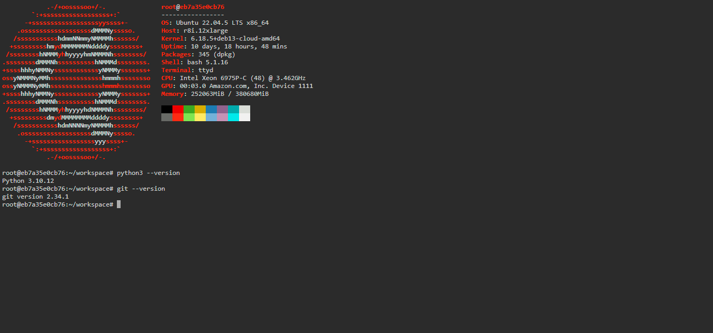

# Ubuntu-on-Railway
**Template Name:** Ubuntu 22.04

## Description
Want to try out Ubuntu or need a lightweight version of Linux available at all times? This project allows you to deploy a fully functional Ubuntu environment in the cloud.

This project utilizes the official [Ubuntu 22.04](https://hub.docker.com/_/ubuntu) image to deploy a container that supports most CLI tools. It uses [ttyd](https://github.com/tsl0922/ttyd) to provide a seamless, browser-based terminal experience.

---

### Features
- 🐧 **Official Ubuntu 22.04 LTS base**
- 🔒 **Password-protected web terminal**
- 💻 **Neofetch display on login**
- 🌐 **Accessible via any web browser**

---

## Environment Variables
To ensure your instance is secure, please configure the following variables in your Railway dashboard:

| Variable     | Description                                                                        |
| :----------- | :--------------------------------------------------------------------------------- |
| **PORT**     | The port on which the ttyd program will listen (automatically managed by Railway). |
| **USERNAME** | The username required to login to the web shell.                                   |
| **PASSWORD** | The password required to login to the web shell.                                   |

> **NOTE:** It is strongly advised to provide the **USERNAME** and **PASSWORD** environment variables before deploying the project to prevent unauthorized access.

---

## Deploy and Host
Click the **Deploy on Railway** button above to start the process. The deployment is automatic and typically finishes within a few minutes. Once deployed, the service will be accessible via the public domain provided by Railway.

## Why Deploy
- **Instant Access:** Get an Ubuntu terminal from any device with a browser.
- **Zero Setup:** No local installation or VM configuration required.
- **Testing Ground:** Perfect for learning Linux and testing scripts.
- **Resource Efficient:** Lightweight and fast startup.

## Common Use Cases
- Testing shell scripts and automation.
- Learning Linux command-line basics.
- Remote development environment.
- Package and dependency testing.

## Dependencies for Deployment
Railway handles the Docker orchestration. This template automatically installs the following:
- `wget`, `curl`, `git`
- `python3` & `python3-pip`
- `neofetch`
- `ttyd` (Web Terminal engine)

---

## About Hosting
Railway provides a robust hosting platform featuring:
- Automatic HTTPS/SSL encryption.
- Custom domain support.
- Easy environment variable management.
- Real-time deployment logs.